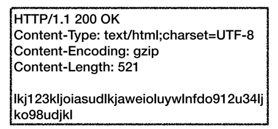

## HTTP 헤더1 - 일반 헤더
HTTP 헤더에는 HTTP 전송에 필요한 메타 데이터가 들어간다.  

### 표현 헤더
특히 헤더 중 표현 헤더는 메시지 바디에 실제로 들어있는 데이터와 관련된 메타 데이터이다.  
표현이라는 것이 생소한데 메시지 바디는 데이터가 들어갈 박스이고 표현 바디는 그 박스에 들어가는 실제 데이터를 말한다.   
왜 표현 바디라고 부르냐면 데이터가 정해진 표현(형태)를 이루고 있어서 그렇게 부른다.  
그러면 표현 헤더는 이러한 표현 바디에 관련된 정보를 가지고 있는 메타데이터인 것이다.

  

표현 헤더들은 위와 같이 특히 저러한 것들이 있다. 

#### Content-Type 헤더

- 표현 헤더에서 이 헤더는 데이터의 형식을 명시한다.

#### Content-Encoding 헤더

- 데이터가 어떤 방식으로 압축되었는지를 알려준다.

#### Content-Language 헤더

- 데이터의 주요 언어를 알려준다.

#### Content-Length 헤더

- 데이터의 길이를 알려준다. 바이트 기준이다.

이것들은 서버가 응답 데이터의 형식을 알려줄 때 이 헤더들을 쓴다.

반대로 클라이언트가 요구하는 특정 형식이 있을 때는 콘텐츠 협상을 한다.

### 콘텐츠 협상
콘텐츠 협상은 클라이언트가 선호하는 형식을 요구하는 것이다. "Accept~"으로 보낸다.

이렇게 우선순위를 숫자를 이용하여 알려줄 수도 있고 구체적으로 적음으로써 우선순위를 알려주는 방식을 쓴다.

### 전송 방식
  
전송 방식을 이렇게 존재한다.

#### 단순 전송
  
단순 전송은 서버가 클라이언트에게 데이터를 보낼 때 미리 전체 데이터의 크기를 알려주고 한번에 데이터를 보내는 방식이다.

#### 압축 전송
  
압축 전송은 데이터를 압축해서 보내는 방식이다.  
  
#### 분할 전송
  
데이터를 한번에 보내지 않고 분할해서 보내는 방식이다.

#### 범위 전송
  
이 방식은 필요한 데이터의 범위만 전송하는 방식인데 이 방식은 클라이언트가 전체 데이터 중 특정 부분만 필요할 때 쓰면 좋다.

### 일반 정보

HTTP의 일반 정보에는 이러한 것들이 있다.

#### From
  
이것은 클라이언트가 서버에게 방문한 자의 이메일 주소를 남기는 용도이다.
예를 들어, 검색 엔진이 웹 사이트를 크롤링 할 때 쓰였는데 이 때 크롤링 담당 근무자의 이메일 주소를 남겼었다.  
만약 문제가 생기면 이 담당자에게 연락하라고 하는 용도로 From이 쓰였었다.
지금은 보안 이슈로 잘 쓰이지 않는다.

#### Referer
Referer은 현재 페이지를 방문하기 전에 있던 웹 페이지 주소

#### User-Agent
클라이언트가 어떤 환경인지 알려준다.

#### Server
보통 요청을 하고 그 응답을 하는 서버 컴퓨터에는 응답을 하는 여러 소프트웨어가 실행되고 있다.  
이 헤더는 서버 안에 어떤 소프트웨어가 응답을 했는지를 알려주기 위한 헤더이다.

#### Date
이 헤더는 HTTP 메시지를 보낼 때의 날짜와 시간을 담는 헤더이다.  
응답과 요청 모두 사용 가능하지만, 실제로는 응답에만 쓰인다. 
왜냐하면 서버는 클라이언트의 Date를 신뢰할 수 없기 때문.

### 특별한 정보

  
이런 것들이 있다.

여기서 특히 Host는 필수인데 이게 뭐냐면 
사실 하나의 서버에는 여러 도메인을 여러 웹 사이트를 운영하는 가상 호스팅 환경이 일반적이다.   
그렇기 때문에 클라이언트가 IP만 가지고 어떤 웹 사이트에 접속해야 할지 알 수 없다.  
그래서 이 Host 헤더를 필수로 명시해야 한다.

### 인증

Authorization 헤더는 클라이언트가 서버에게 아이디와 비밀번호 등 인증에 필요한 정보를 주는 것이고,  
WWW-Authorization 헤더는 만약 클라이언트가 서버에게 인증에 충분하지 않은 정보를 주었을때,
서버가 클라이언트에게 인증 방식을 알려주는 것이다.

### 쿠키

  

HTTP 통신은 무상태 프로토콜이다.  
그니까 클라이언트가 서버에게 메시지를 주었을때 서버는 그것을 기억하지 못한다.  
그래서 매번 클라이언트는 필요한 정보들을 모두 메시지에 담아서 보내야 하는데 이를 URI에 모두 넣어서 보내기엔 너무 길어지고 힘들다.  
그렇기 때문에 클라이언트의 웹 브라우저의 쿠키 저장소에 서버가 알아야 하는 정보들을 저장시키고 다음 메시지에 저절로 그 쿠키 저장소에 있는 쿠키값을 헤더에 넣어서 보낸다.

