## HTTP 헤더2 - 캐시와 조건부 요청

앞에서 쿠키에 대해서 공부했다. 쿠키는 사용자에 관련된 정보을 말하는 것이다.
이번엔 캐시에 대해 공부할 것인데 캐시는 웹 자원에 관련된 정보을 말하는 것이다.

### 캐시: 기본 동작과 필요성
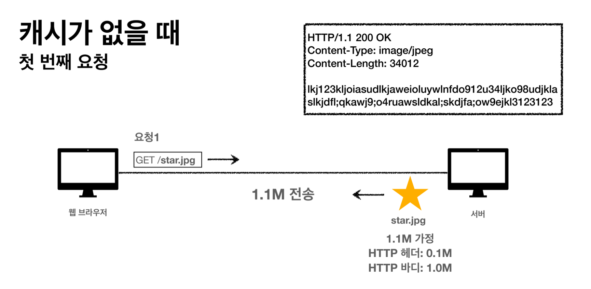

저렇게 캐시가 없다면 서버에서 헤더와 바디 합쳐서 1.1M을 보내야 한다. 
그런데 똑같은 자원을 웹 브라우저가 서버에게 또 요청했을때 똑같은 바디를 응답하면 네트워크적으로나 속도 차원 등 효율이 안 좋다.  

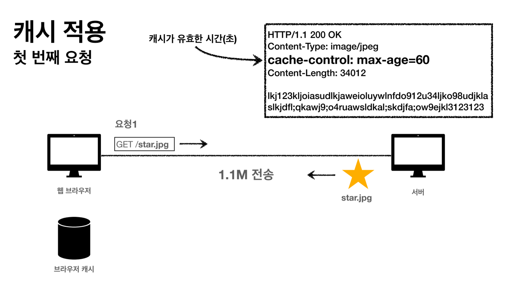
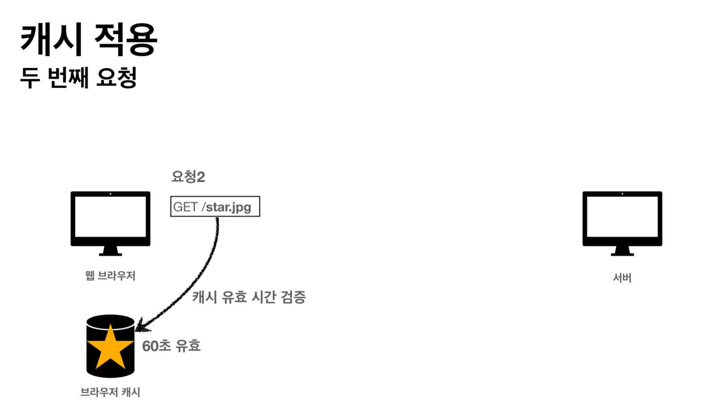
그래서 응답 받은 리소스를 캐시로 웹 브라우저에 저장시킨다.  
다음에 똑같은 리소스의 요청을 웹 브라우저가 했을 때 만약 브라우저 내에 그 자원의 캐시가 있다면 서버가 그 리소스의 바디를 전송하지 않고 헤더만 보내서 효율을 높인다.
저렇게 브라우저 캐시에 저장된 캐시의 유효 시간을 체크하고 유효한 시간이면 웹 브라우저가 가져다가 쓴다. 

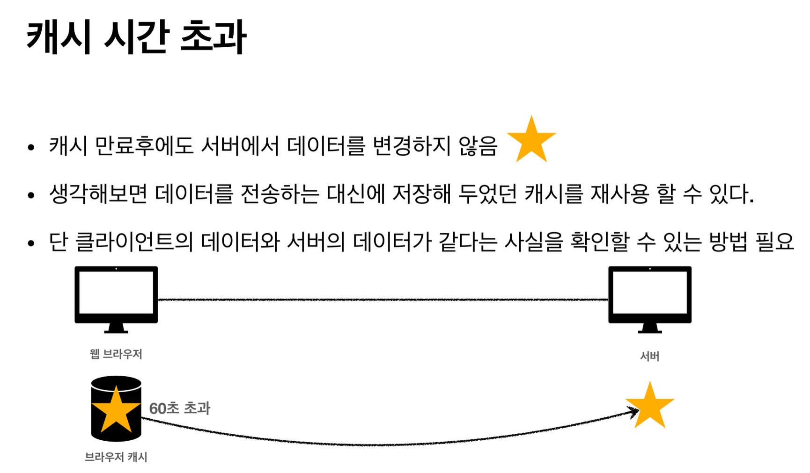
만약 캐시 유효 시간이 초과되었을 땐 어떻게 될까?
웹 브라우저가 서버에게 그 자원의 요청을 보내는데 만약 이 리소스의 데이터가 변경되지 않았을 때는 서버에서 그냥 캐시 사용하라고 알려준다.

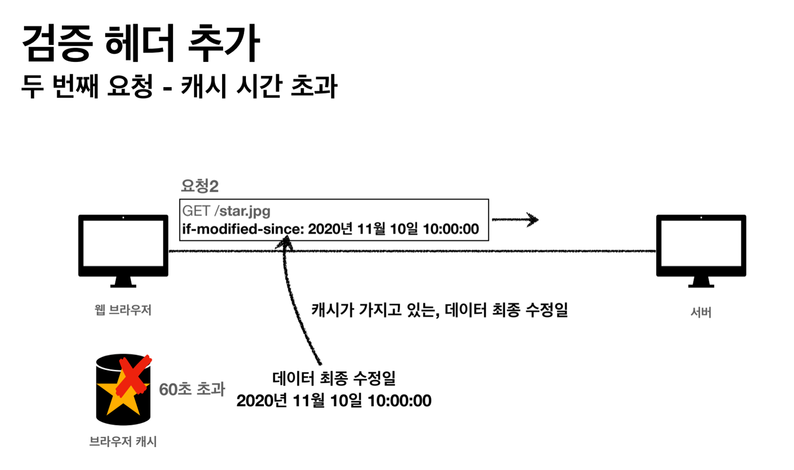
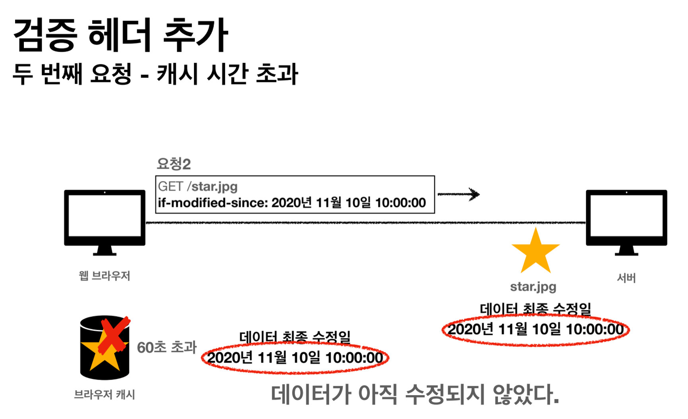
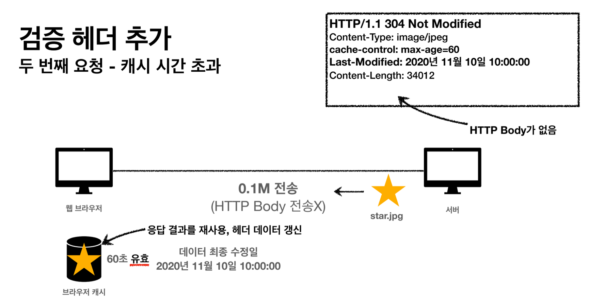
이런 과정으로 갱신된다.

그런데 위와 같은 방식은 단점이 있다.
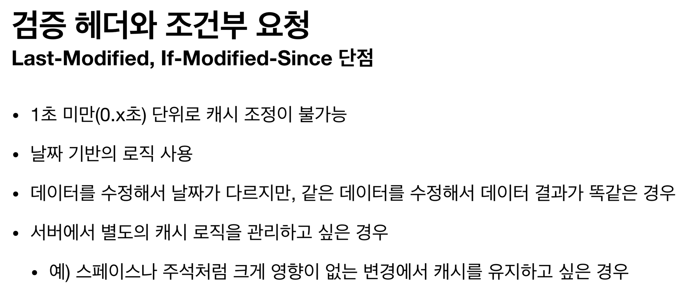
만약 저렇게 데이터 최종 수정일은 달라도 캐시와 서버의 리소스가 결국 같은 리소스라면?  
예를 들어 브라우저 캐시에 a가 저장되어 있고 서버에서는 a->b->a 일 때 결국 같은 리소스인데 수정된 날짜가 달라서 위와 같은 방식으로는 
바디를 다시 받아야 한다. 그러면 비효율적.
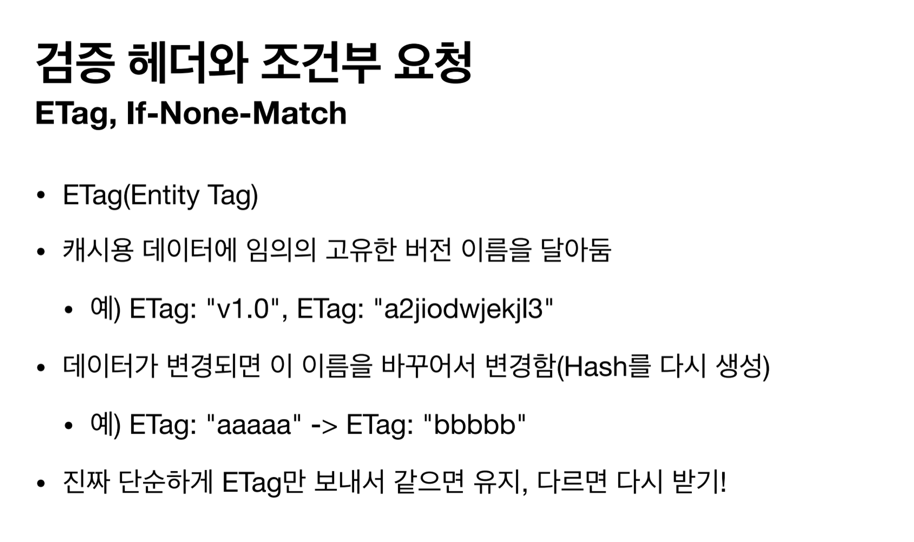
그렇기 때문에 도입한 방법이 위와 같다.
저렇게 데이터가 같은 버전인지 구별을 할 수만 있으면 수정된 날짜가 다르더라도 그대로 캐시를 활용하여 효율적으로 할 수 있다.

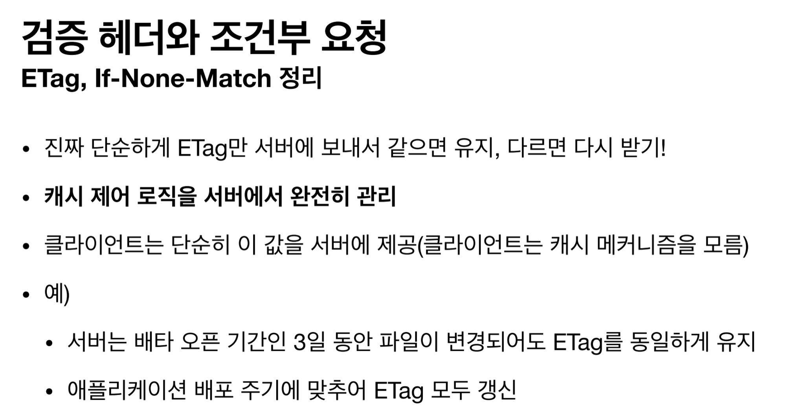
정리하면 위와 같다.

이제 캐시를 제어하는 헤더에 깊게 알아보겠다.
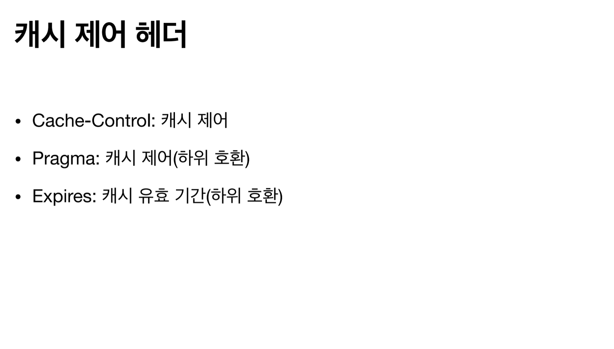
이렇게 크게 3가지가 있다. 하지만 Cache-Control말고는 구식이라 캐시 제어를 할 때는 Cache-Control을 쓰면 된다.
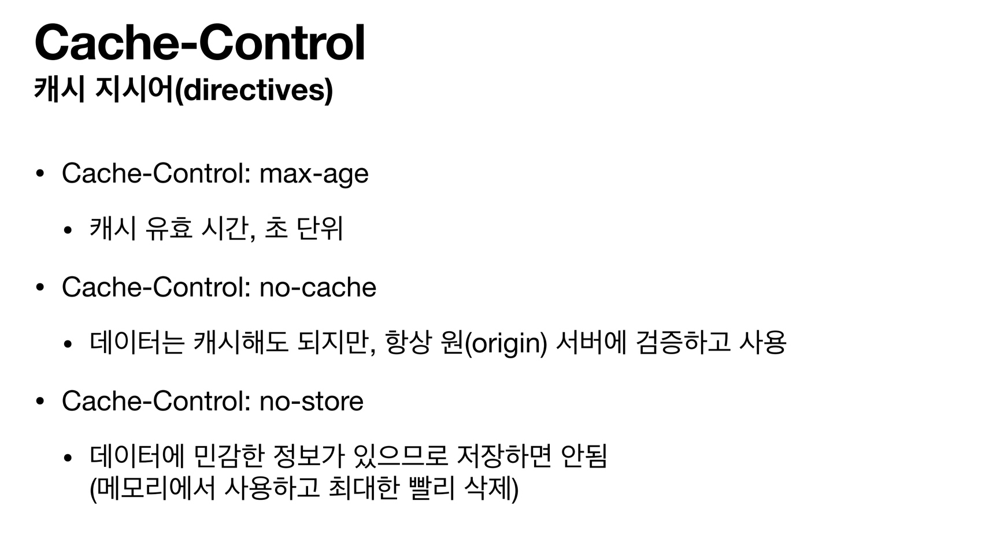  
Cache-Control은 이렇게 사용하면 되는데 이 중에서 no-cache애서 원(origin) 서버가 뭐냐면 원본 데이터를 가진 서버이다.

이번엔 프록시 캐시를 대해 알아보겠다.
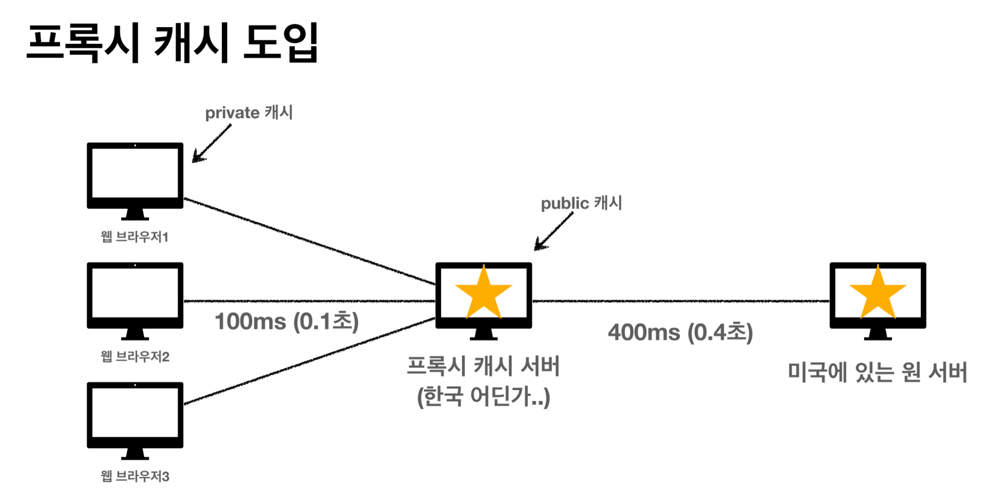
프록시 서버는 중간 지점을 하는 서버이다. 
웹 브라우저가 요청하면 사실 프록시 서버에 요청하는 것인데 만약 이 프록시 서버에 해당 리소스가 없으면 프록시 서버는 원 서버에 해당 리소스를 요청하고
원 서버로의 응답을 받아 프록시 서버는 웹 브라우저에 응답을 보낸다. 동시에 그 데이터를 캐시로 저장한다.  
다음에 프로시 서버는 같은 요청을 받으면 그 리소스가 캐시로 저장되어 있기 때문에 웹 브라우저는 빠르게 응답 받을 수 있다.

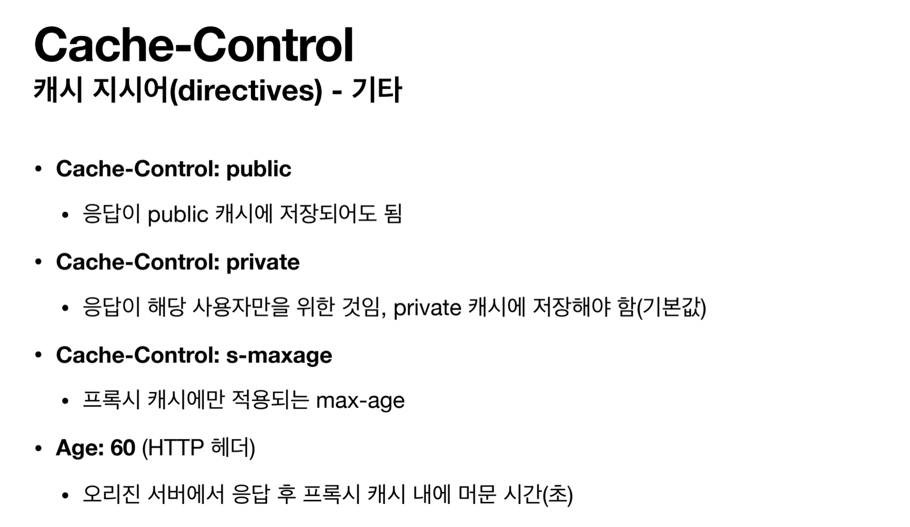
원 서버가 프록시 서버에게 응답을 캐시로 저장하라고 할 때,  
이 응답을 모든 사람이 응답 받을 수 있게 공동 캐시에 저장시키려면 public,  
현재 요청한 사람만 응답 받을 수 있게 개인 캐시에만 저장시키려면 private로 지시해야 한다.