## 웹 애플리케이션의 이해

### 웹 서버와 웹 애플리케이션 서버

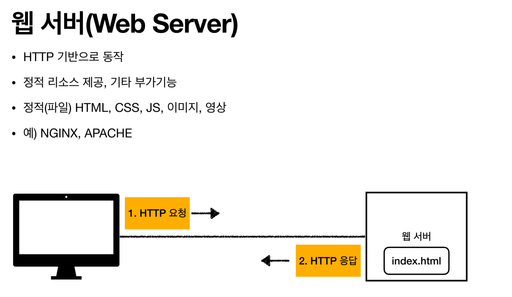  
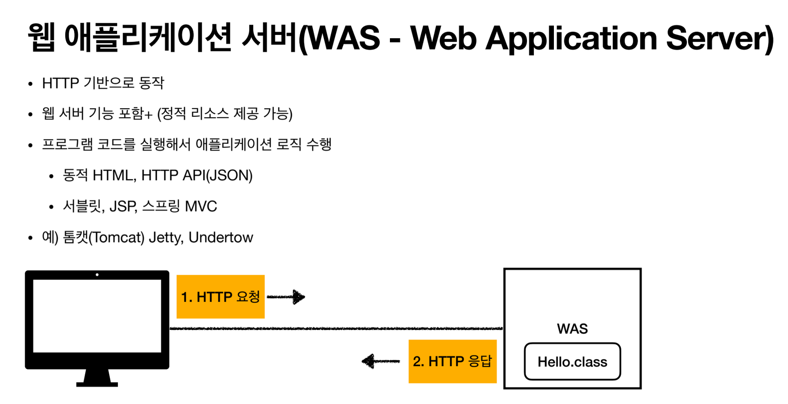

웹 서버와 웹 애플리케이션 서버는 둘 다 비슷한 기능을 제공하지만 어떤 것에 특화되어 있느냐에 중요하다.
웹 서버는 미리 준비된 정적 데이터를 제공하는데 특화되어있고, 웹 애플리케이션 서버는 요청을 애플리케이션의 코드를 실행하여 해석하고 가공된 동적 데이터를 제공하는데 특화되어있다.  

웹 시스템 구성은 아래와 같다.  
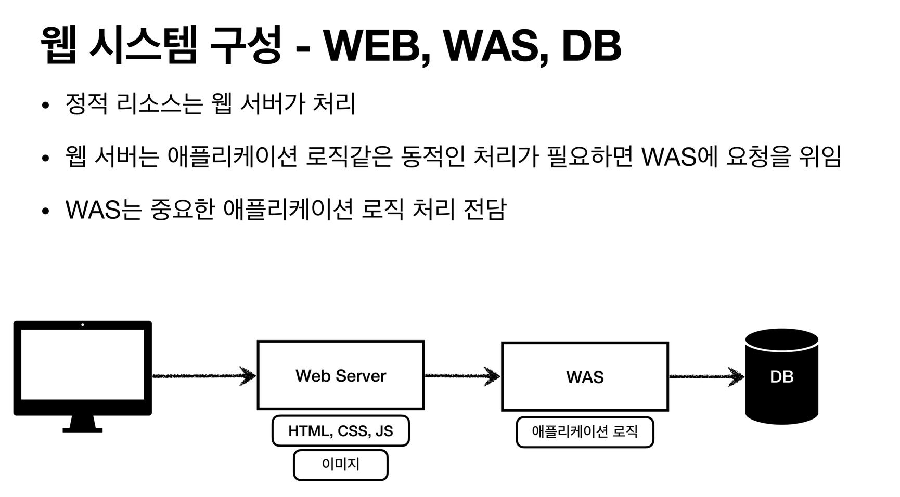
이렇게 구성한 이유는 웹 서버는 로직이 단순하여 잘 죽지 않는데 웹 애플리케이션 서버는 잘 죽는다. 
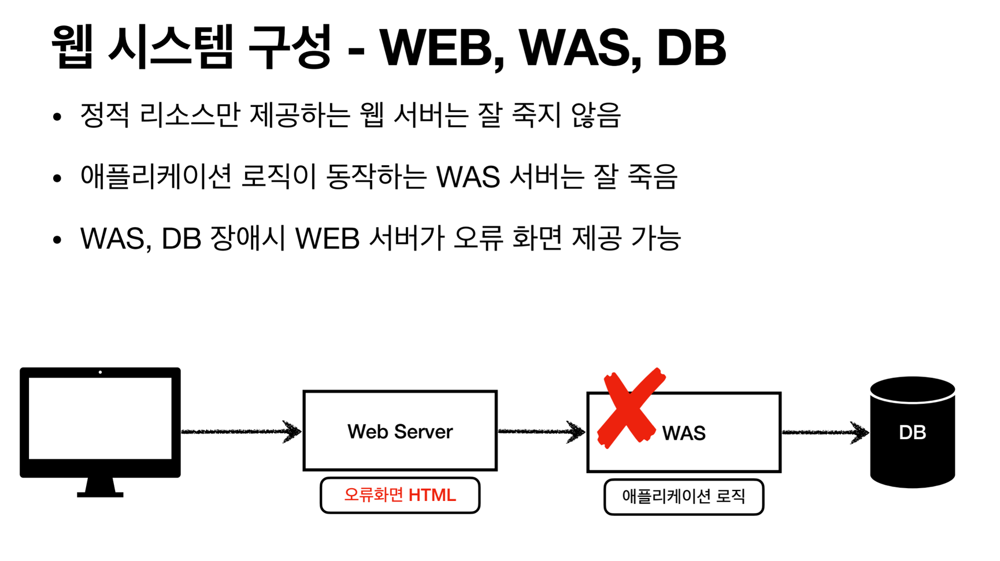
그래서 저렇게 배치를 하는 것이고 만약 웹 애플리케이션 서버가 죽으면 웹 서버가 오류 html을 제공하면 된다.
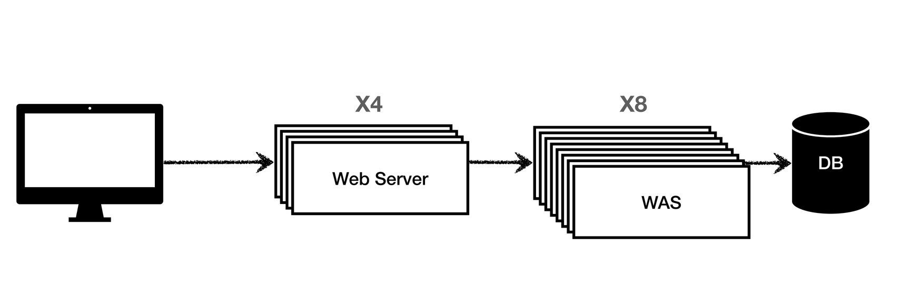
이런 구성은 부하에 따라 서버의 양을 증설하여 효율적으로 관리할 수 있다.

### 서블릿

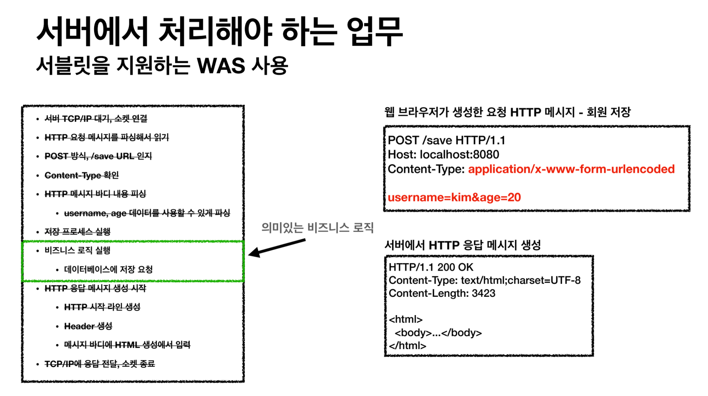
웹 애플리케이션 서버를 개발자가 개발하려면 저런 요청을 해석하고 비지니스 로직, 응답을 만들어 전송하는 모든 부분을 개발해야 하는데
모든 개발자들이 저런 부분을 만들면 비효율적이다. 
그래서 웹 애플리케이션 서버의 비지니스 로직만 집중하여 개발자가 개발할 수 있게 다른 부분의 기능을 제공하는 것이 서블릿이다

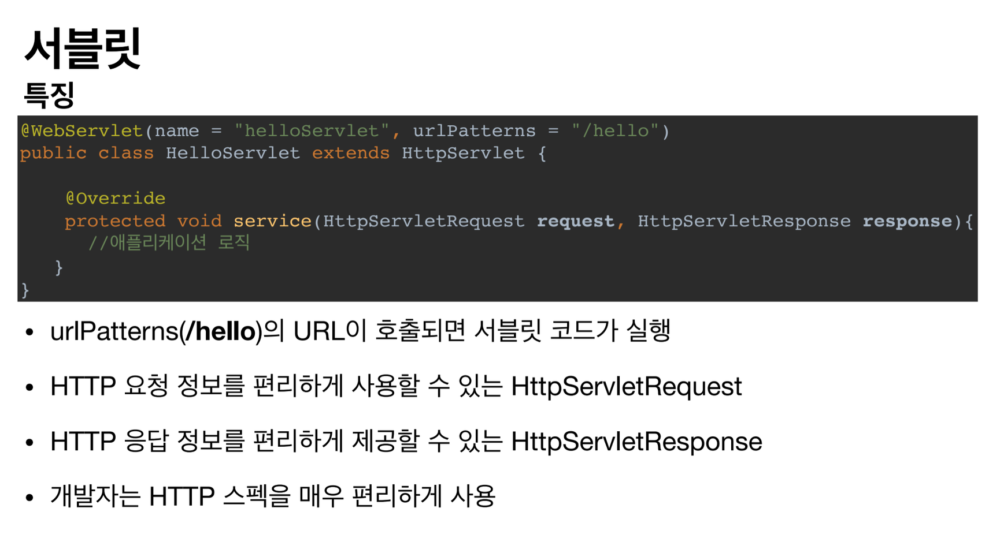
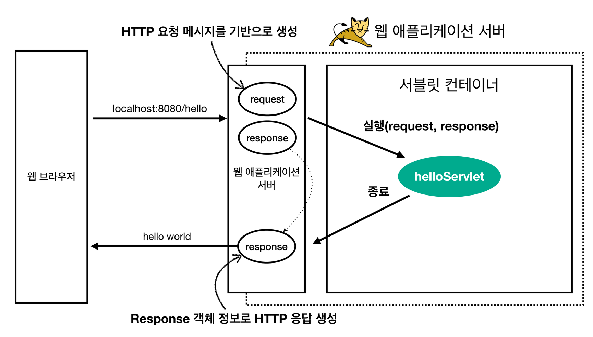
과정은 이러하다.
[클라이언트] --> HTTP 요청 --> [웹 애플리케이션 서버 (Tomcat 등)]
서블릿을 지원하는 웹 애플리케이션 서버를 서블릿 컨테이너라고 한다. 서블릿을 관리하니까.

1. WAS는 요청 URL에 맞는 서블릿을 찾고, 서블릿 객체를 생성한다. (싱글톤).
2. WAS는  HttpServletRequest 객체를 생성하여 요청 정보를 담고, 빈 HttpServletResponse 객체를 생성한다.
3. WAS는 서블릿 객체의 service() 메서드를 호출하고, HttpServletRequest, HttpServletResponse 객체를 넘겨준다.
4. [서블릿]
    * HttpServletRequest 객체에서 필요한 정보를 꺼낸다.
    * 비즈니스 로직을 수행하여 결과를 생성한다.
    * HttpServletResponse 객체에 응답 정보를 담는다.
5. [웹 애플리케이션 서버]  HttpServletResponse 객체를 기반으로 HTTP 응답을 생성하여 클라이언트에게 전송합니다.

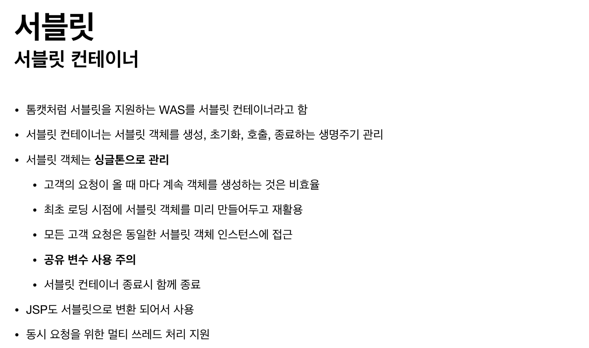
서블릿 객체를 싱글톤으로 관리한다.

### WAS는 멀티 쓰레드를 지원한다
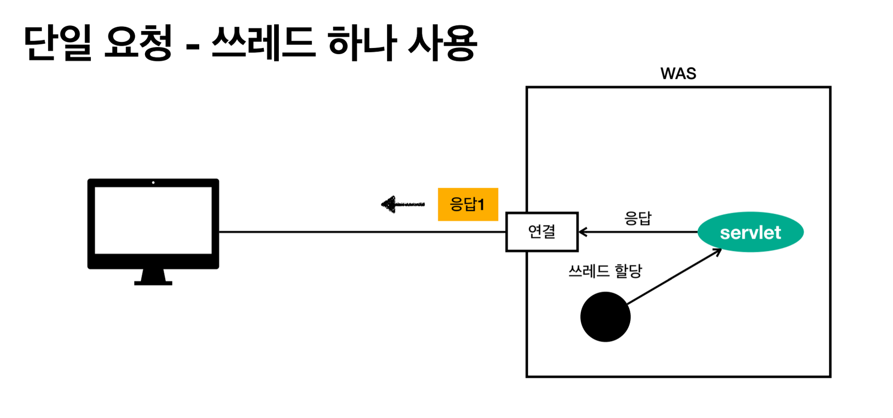
서블릿은 누가 호출할까? 쓰레드가 호출한다.
쓰레드? 일단 프로그램은 디스크에 적재된 정직 상태인 파일이다. 이 프로그램을 실행하면 운영체제를 메모리에 적재하는데 여러 프로세스로 적재 시킨다.
CPU는 프로세서이다. 이 CPU의 작업 단위가 쓰레드이다. 이 쓰레드는 한번에 한 줄의 코드를 읽을 수 있다. 하나의 프로세스를 여러 쓰레드들이 담당하여 처리한다.

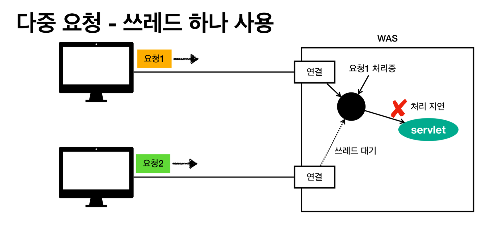
자 다시 돌아와서 서블릿이 호출된다고 치자. 이 서블릿을 하나의 쓰레드가 처리하고 있는데 만약 다른 여러 요청이 들어오면 이 쓰레드가 처리할 때까지 기다려야 한다.
그러면 굉장히 시간이 많이 걸릴 것이다. 이 서블릿의 요청이 들어올 때마다 쓰레드를 생성하고 처리한다음 쓰레드를 없애면 이렇게 기다릴 필요없이 
바로바로 처리할 수 있을 것이다. 그런데 이렇게 서블릿의 요청마다 쓰레드를 생성하면 비용이 많이 든다. 예로 생성하는 시간도 있을 것이고
사실 쓰레드라는 건 CPU가 작업을 왔다갔다 하는 것이라 이 왔다갔다하는 컨텍스트 스위칭의 비용이 들고 이 요청이 한 없이 많이 온다면 
서버가 죽을 수도 있다. 이런 것을 해결하기 위해 쓰레드 풀이라는 개념을 도입한다.

#### 쓰레드 풀
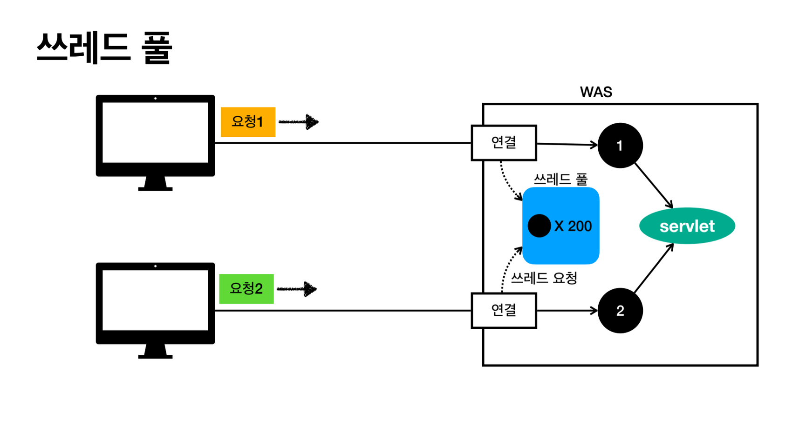
쓰레드 풀은 먼저 쓰레드들을 생성해 놓고 요청이 들어오면 필요한 쓰레드들을 매칭시켜주는 것이다. 작업이 끝나면 쓰레드를 제거하지 말고
쓰레드 풀로 다시 돌려 놓는다. 이렇게 하면 위의 서버가 수많은 요청들로 죽어버리거나 쓰레드들 생성하고 종료하는 시간들을 절약할 수 있다.

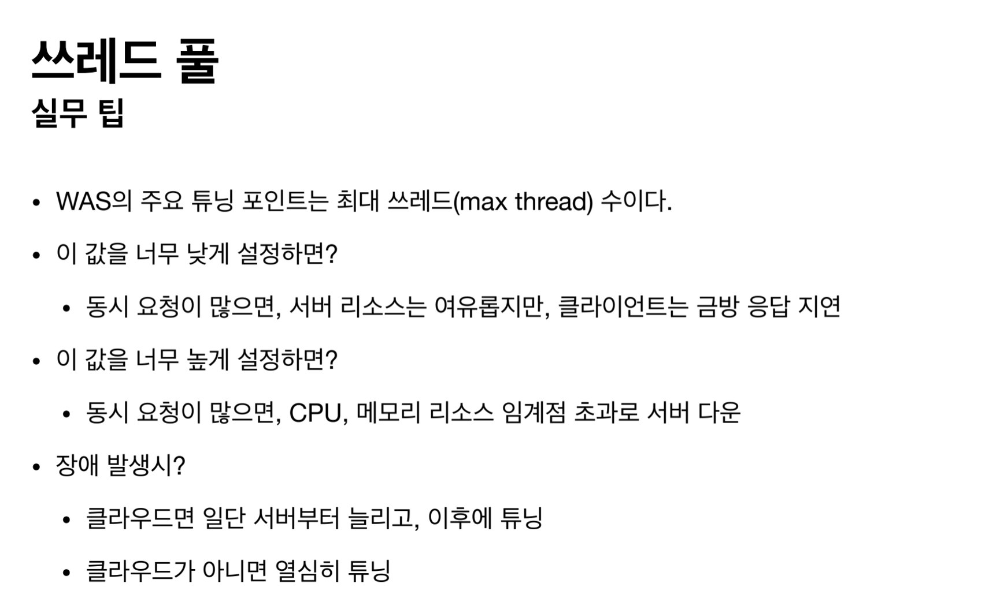
실무에서 백엔드 개발자는 상황에 따라 이 쓰레드의 개수값을 잘 설정해야한다.

다행인 것은 이 쓰레드들 생성시키고 이런 것들은 매우 복잡한데 WAS 안에서 알아서 해주는 것이고 개발자는 그 값만 설정해주면 된다는 것이다.

### HTML, HTTP API, CSR, SSR
백엔드 개발자는 HTTP 통신에 대해 3가지 포인트에 고민을 해야 한다.
1. 정적인 리소스를 보낼 때 어떻게 효율적으로 보내줄까
   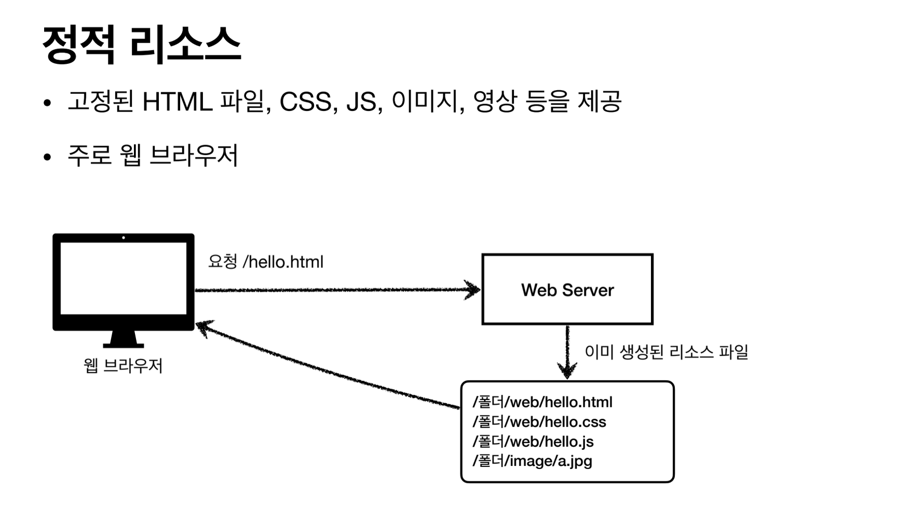
2. 동적으로 생성되는 HTML 페이지를 어떻게 효율적으로 보내줄까
   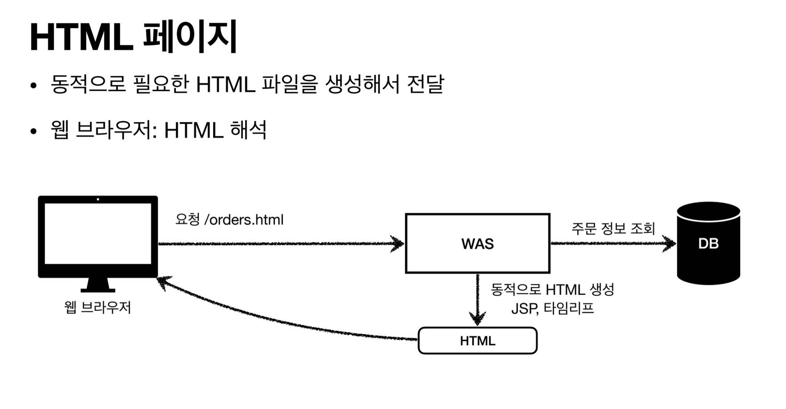
3. HTML 없이 리소스만 보내는 HTTP API 방식일 때 어떻게 효율적으로 보내줄까
   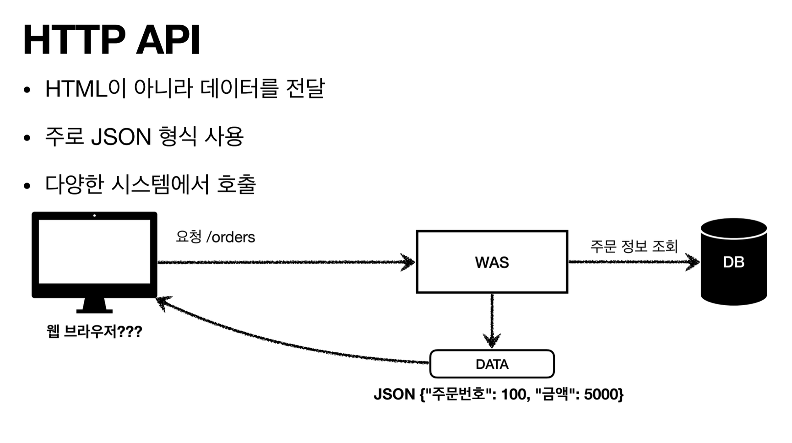
   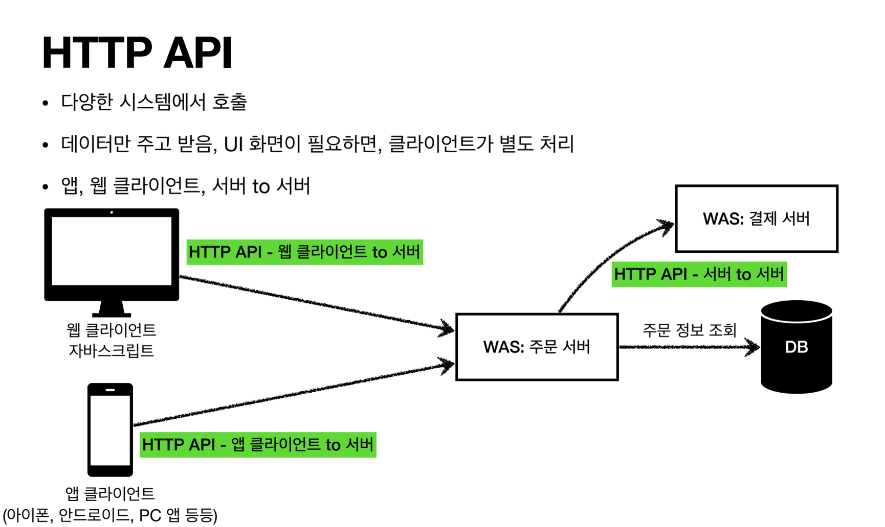  
   이렇게 HTML 파일 없이 서버에서 데이터만 전송하면 클라이언트 쪽에서는 알아서 해석해서 HTML로 페이지를 보여줄 수도 있다.

#### SSR - 서버사이드 렌더링, CSR - 클라이언트 사이드 렌더링
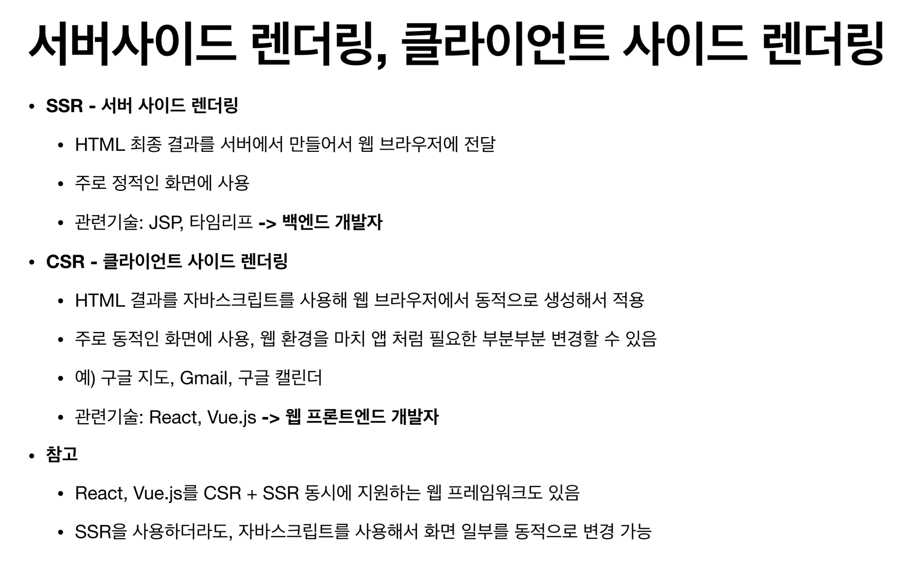
여기서 렌더링이란 눈에 보이는 화면을 바꿔주는 것.

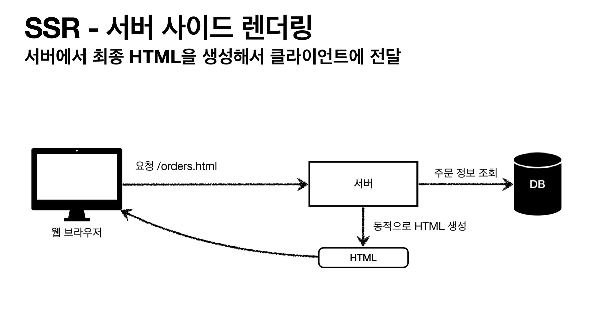
서버 쪽에서 HTML을 생성하여 클라이언트에게 넘겨주는 것.

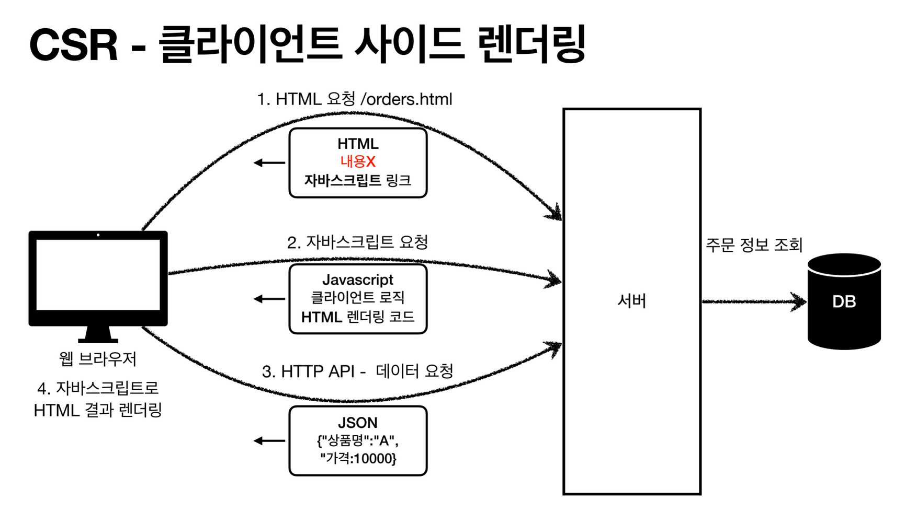
클라이언트 쪽에서 동적으로 HTML을 생성하는 것이다.
서버가 뼈대 HTML, 자바스크립트파일, 데이터를 보내면 클라이언트인 웹 브라우저가 자바스크립트를 활용하여 데이터를 토대로 동적으로 HTML을 생성한다.

### 자바 백엔드 웹 기술 역사
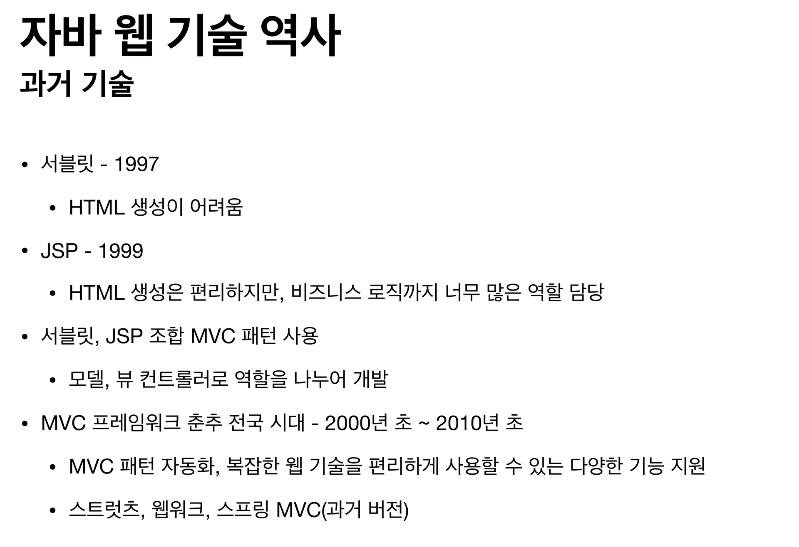
자바를 활용한 웹 기술의 역사는 이러하다.
서블릿을 활용했었는데 이는 HTML 생성이 어려웠다. 예를 들어 HTML 코드를 println과 같은 메서드로 작성해야 했다. 굉장히 힘든 일이다.  
그 후에 JSP를 활용하여 이 서블릿의 단점인 HTML 생성을 보완했다. 하지만 자바코드와 HTML 코드가 혼합되어 있어서 유지보수가 어려웠다.  
그 후에 이 서블릿과 JSP를 적절히 조합해서 단점을 보완한 MVC패턴이 등장했고 수많은 MVC 프레임워크가 세상에 나왔다.  

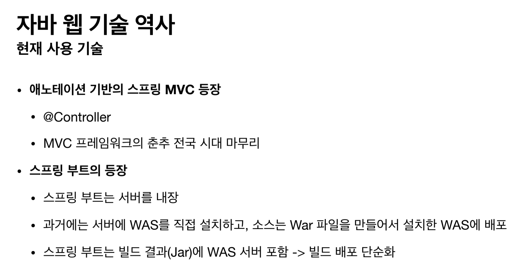
그 후에 간편한 애노테이션 기반의 스프링 MVC가 보편화되면서 MVC 표준이 되었다.
예전에는 웹 애플리케이션를 서버에서 실행하려면 서버에 WAS를 일일히 설치하고 설정해야만 했다. 굉장히 번거롭고 힘들었다.  
그 후 스프링 부트가 나왔는데 이것을 이용하여 개발자가 프로그램을 만들면 프로젝트 안에 기본으로 WAS가 내장되어 있고 빌드해서 나오는 
JAR 안에 저절로 WAS가 탑재되어있기 때문에 서버에 이 웹 애플리케이션을 실행할 때 WAS를 힘들게 설치할 필요가 없어졌다.
그래서 많이 쓰인다.

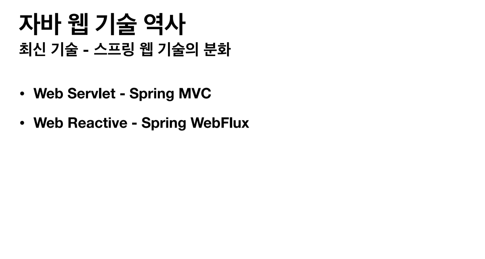
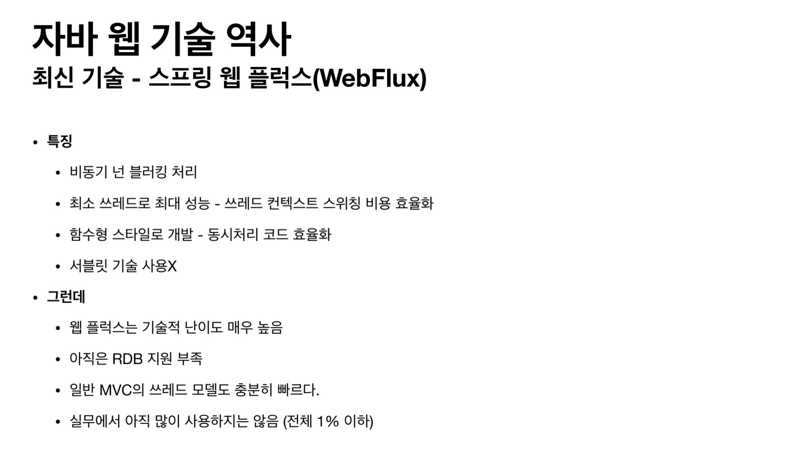
스프링 웹 기술은 서블릿 기반의 Spring MVC와 리액티브 기반의 Spring WebFlux로 나눠졌는데
Spring MVC는 오랫동안 쓰였기 때문에 호환성이 좋은 것. 하지만 크게 효율적은 아닌 것.  
Spring WebFlux는 적은 쓰레드 수로도 요청을 다 해낼 수 있어 효율적이지만 학습 난이도가 높다.
대부분 Spring MVC로도 해결할 수 있기 때문에 Spring WebFlux은 잘 안쓰인다

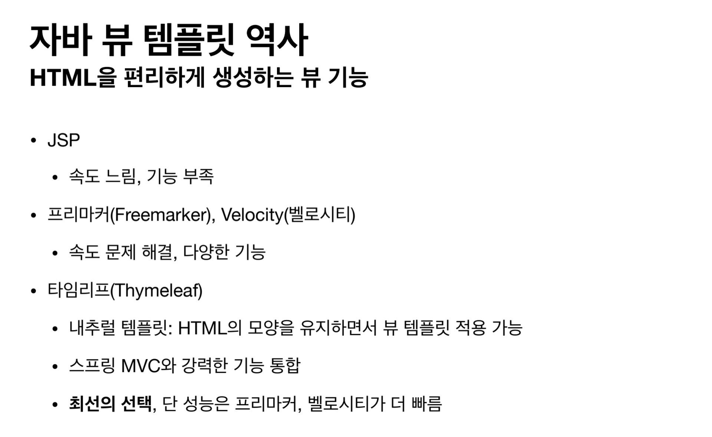
타임리프는 간편하고 속도도 빠른 편이라 스프링 MVC 프로젝트할 때는 타임리프를 쓰는 것이 무난하게 좋다.

