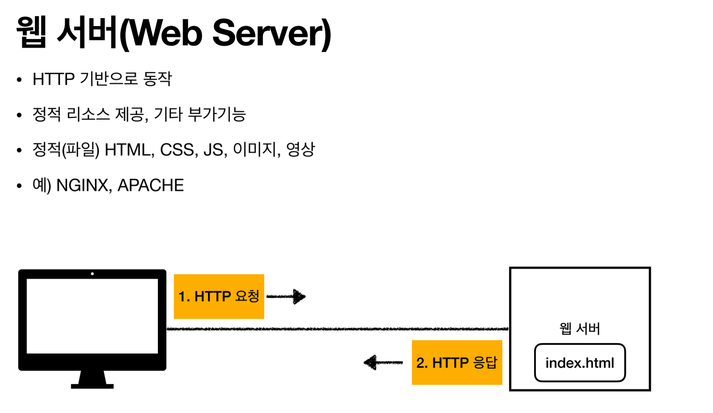
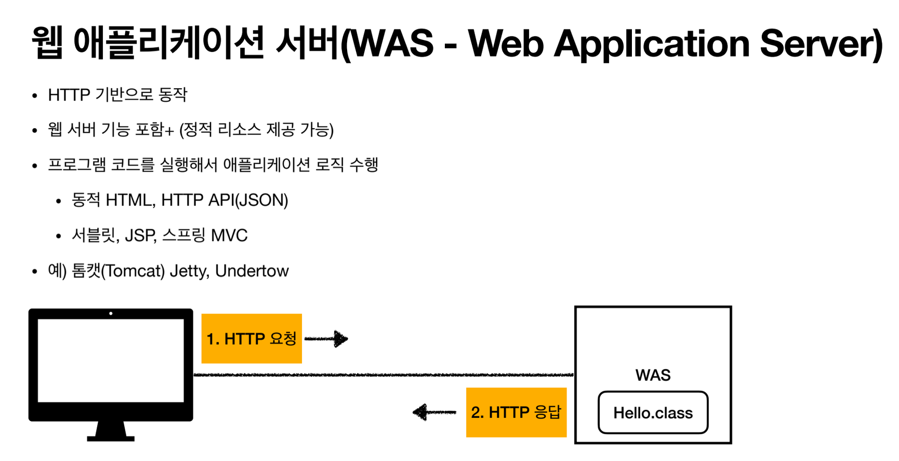
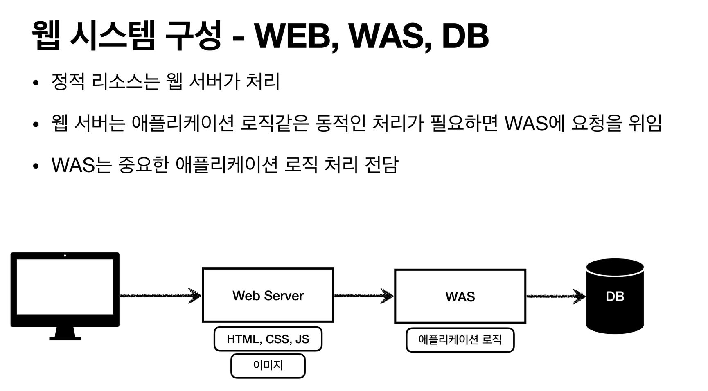
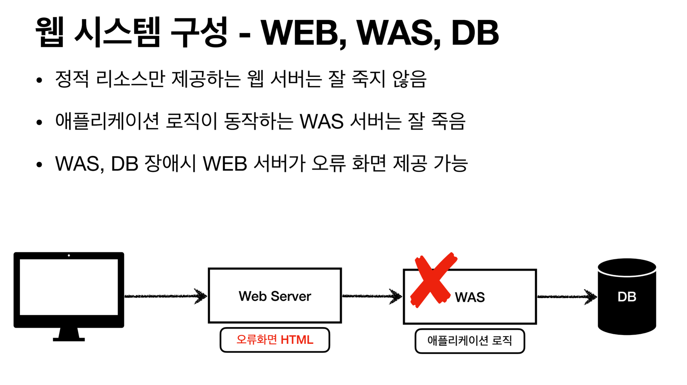
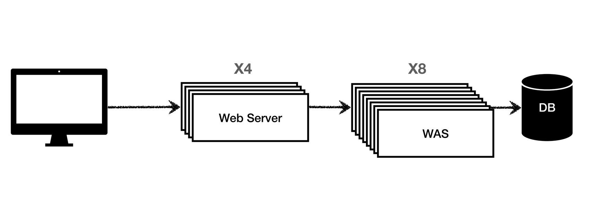
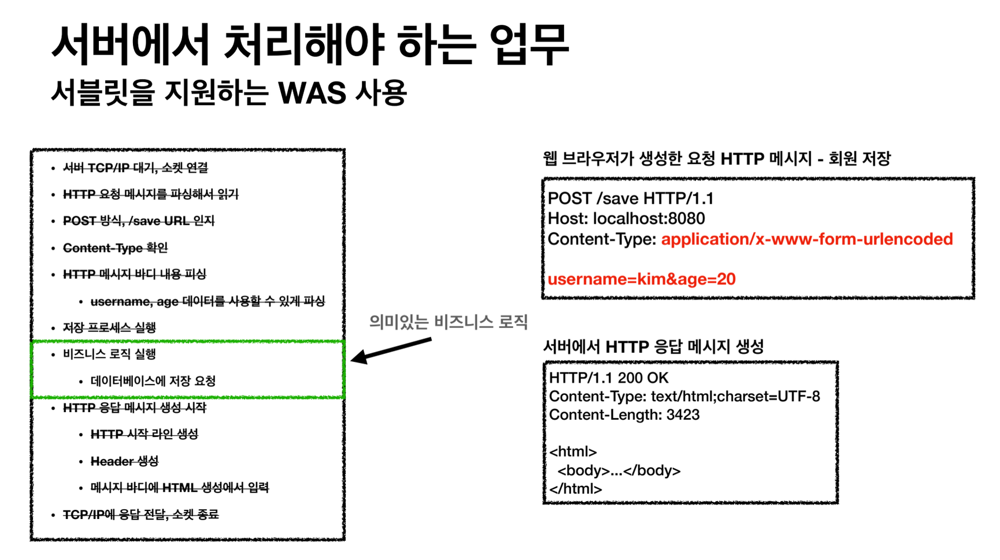
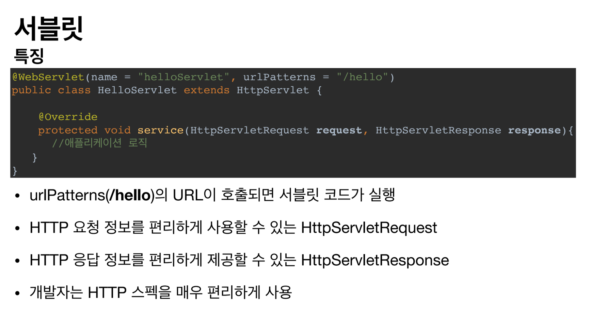
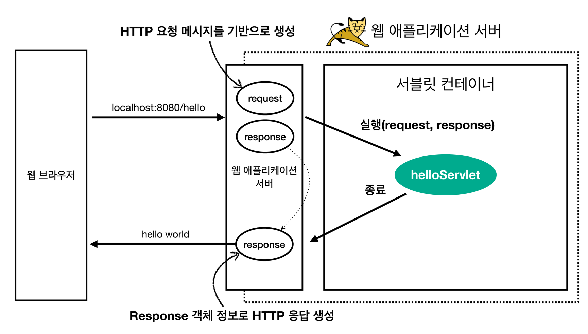
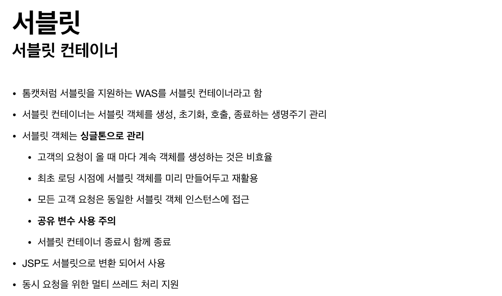

## 웹 애플리케이션의 이해

### 웹 서버와 웹 애플리케이션 서버

  

웹 서버와 웹 애플리케이션 서버는 둘 다 비슷한 기능을 제공하지만 어떤 것에 특화되어 있느냐에 중요하다.
웹 서버는 미리 준비된 정적 데이터를 제공하는데 특화되어있고, 웹 애플리케이션 서버는 요청을 애플리케이션의 코드를 실행하여 해석하고 가공된 동적 데이터를 제공하는데 특화되어있다.  

웹 시스템 구성은 아래와 같다.  

이렇게 구성한 이유는 웹 서버는 로직이 단순하여 잘 죽지 않는데 웹 애플리케이션 서버는 잘 죽는다. 

그래서 저렇게 배치를 하는 것이고 만약 웹 애플리케이션 서버가 죽으면 웹 서버가 오류 html을 제공하면 된다.

이런 구성은 부하에 따라 서버의 양을 증설하여 효율적으로 관리할 수 있다.

### 서블릿

웹 애플리케이션 서버를 개발자가 개발하려면 저런 요청을 해석하고 비지니스 로직, 응답을 만들어 전송하는 모든 부분을 개발해야 하는데
모든 개발자들이 저런 부분을 만들면 비효율적이다. 
그래서 웹 애플리케이션 서버의 비지니스 로직만 집중하여 개발자가 개발할 수 있게 다른 부분의 기능을 제공하는 것이 서블릿이다

과정은 이러하다.
[클라이언트] --> HTTP 요청 --> [웹 애플리케이션 서버 (Tomcat 등)]
서블릿을 지원하는 웹 애플리케이션 서버를 서블릿 컨테이너라고 한다. 서블릿을 관리하니까.

1. WAS는 요청 URL에 맞는 서블릿을 찾고, 서블릿 객체를 생성한다. (싱글톤).
2. WAS는  HttpServletRequest 객체를 생성하여 요청 정보를 담고, 빈 HttpServletResponse 객체를 생성한다.
3. WAS는 서블릿 객체의 service() 메서드를 호출하고, HttpServletRequest, HttpServletResponse 객체를 넘겨준다.
4. [서블릿]
    * HttpServletRequest 객체에서 필요한 정보를 꺼낸다.
    * 비즈니스 로직을 수행하여 결과를 생성한다.
    * HttpServletResponse 객체에 응답 정보를 담는다.
5. [웹 애플리케이션 서버]  HttpServletResponse 객체를 기반으로 HTTP 응답을 생성하여 클라이언트에게 전송합니다.

서블릿 객체를 싱글톤으로 관리한다.

